# Documentation Project02: Plant Control

### Team

- Jedinger Peter - Product Owner
- Pühringer Iris - Scrum Master
- Weiss Richard
- Plank Christoph
- Karrer Alexander 
- Schneeweiß Christian

### Project02: Plant Control

- [Story](PlantControl-Story.md)
- [Video](https://drive.google.com/open?id=1VrEJ2p_KDlwcRBIoyBeCPNl0cd-y5ttx)

#### Technical scenario

We have two plant pots that are monitored with raindrop sensors to get the moisture levels of the soil. This data is used for the watering mechanism to decide if the plant needs to be watered or not. 

Plant Control has an automatic watering system which consists of a scale for measuring how much water is left in the water tank, two relays which handle the de-/activation of the pipes to water the plants and a RGB led for displaying if there is enough water in the tank.

The greenhouse has a monitoring system for the temperature and humidity, which consists of a humidity/temperature sensor and a relay to de-/activate the AC if needed. Furthermore a flame sensor is installed to detect flames inside the greenhouse. If flames are detected a notification and an alarm will be shown inside the dashboard.

All the above mentioned data is displayed in a beautiful dashboard for the user. 

To secure the greenhouse against unauthorized people the door can only be unlocked via RFID and the right card/chip.

#### Implementation

- [JSON-File](plantcontrol.json)

- Node-RED flow

  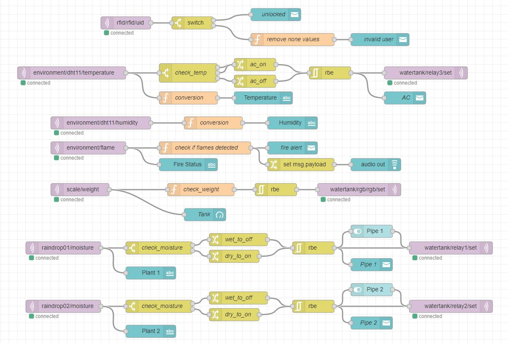

- Dashboard

  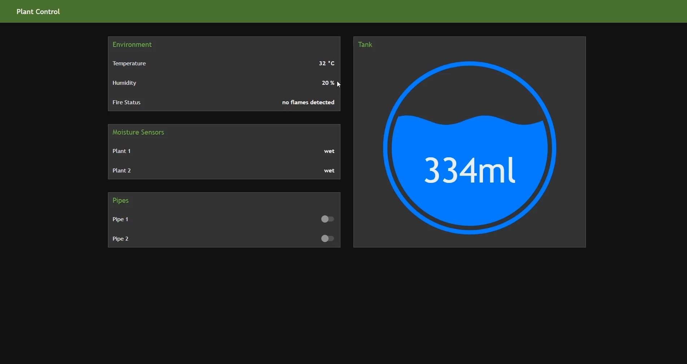

- Plant Control Overview

  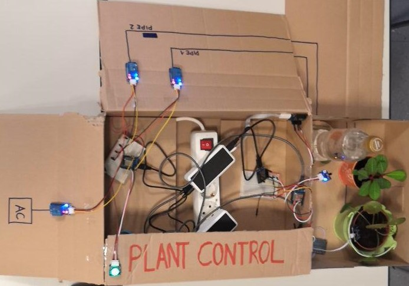

#### Node Setup

##### rfid-node

- Setup.cpp

  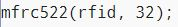

- Node-RED flow

  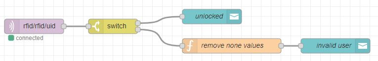

##### environment-node

- Setup.cpp

  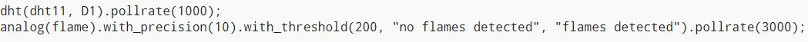

- Node-RED flow

  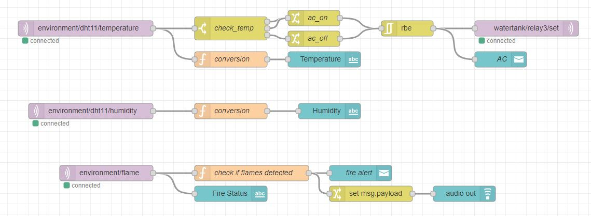

##### scale-node

- Setup.cpp

  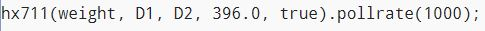

- Node-RED flow

  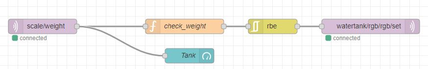

##### raindrop01-node

- Setup.cpp

  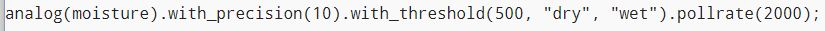

- Node-RED flow

  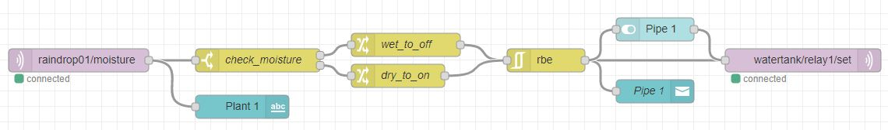

##### raindrop02-node

- Setup.cpp

  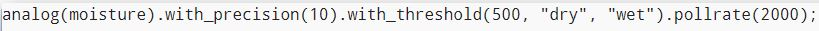

- Node-RED flow

  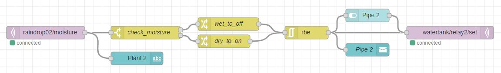

##### watertank-node

- Setup.cpp

  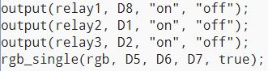

- Node-RED flow

  See flows above. Only publish values to watertank -> no subscribe

### Problems

Adopting and deploying to the nodes again ...

RGB-LED was wrongly connected at first -> wrong colors

Our RGB-LED got wrong values at the beginning because we forgot that the scale sends the calibration value as well

We had to remove the none values of the RFID module otherwise there would have been a notification visible at all times

